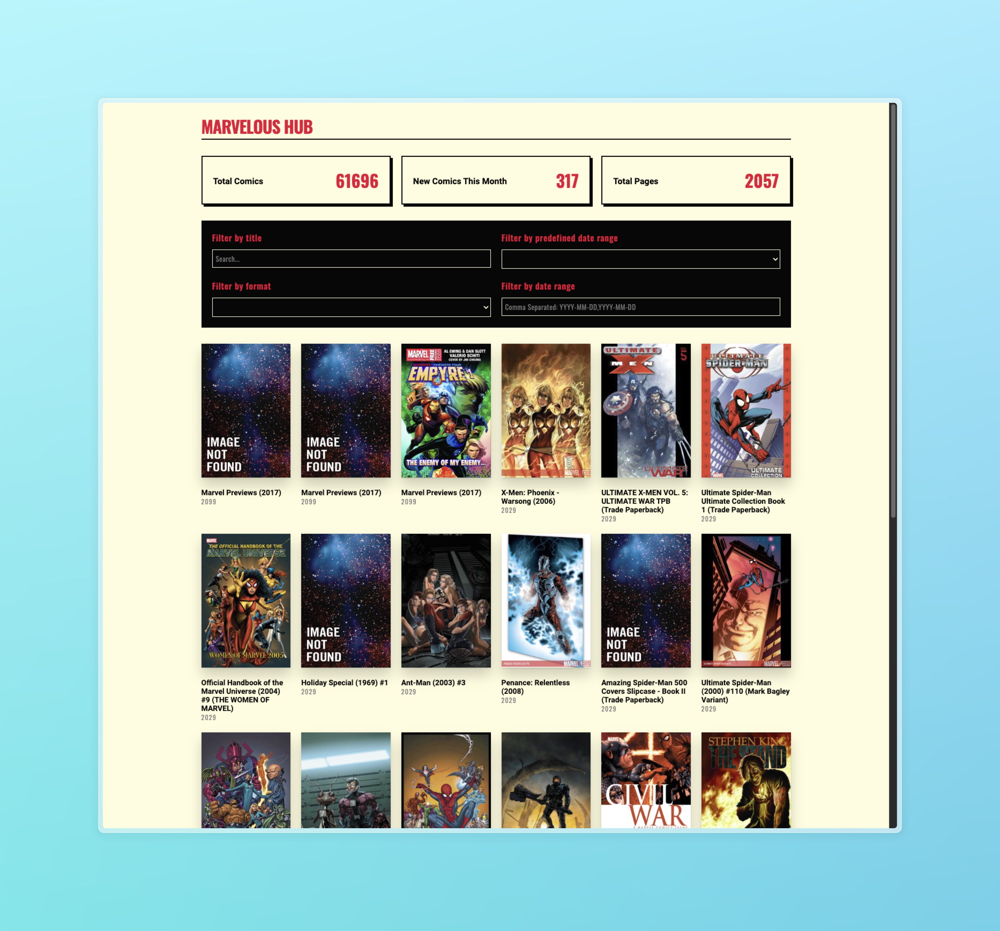
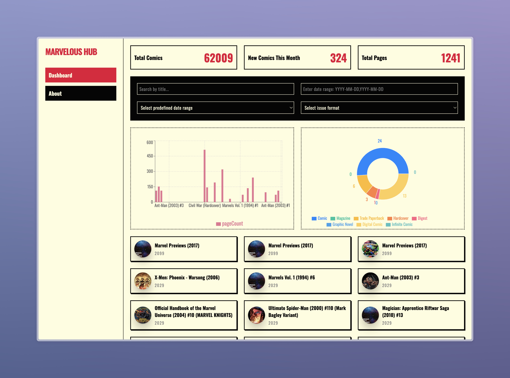
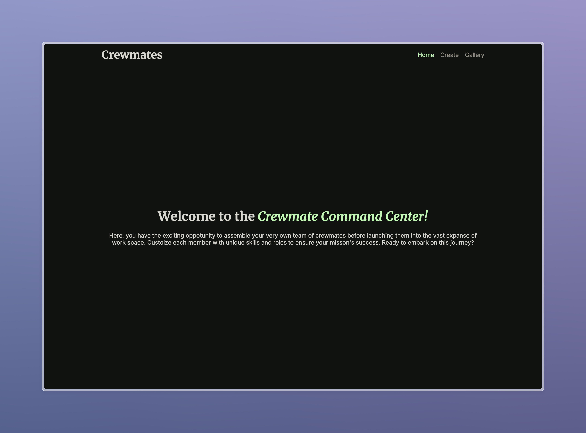
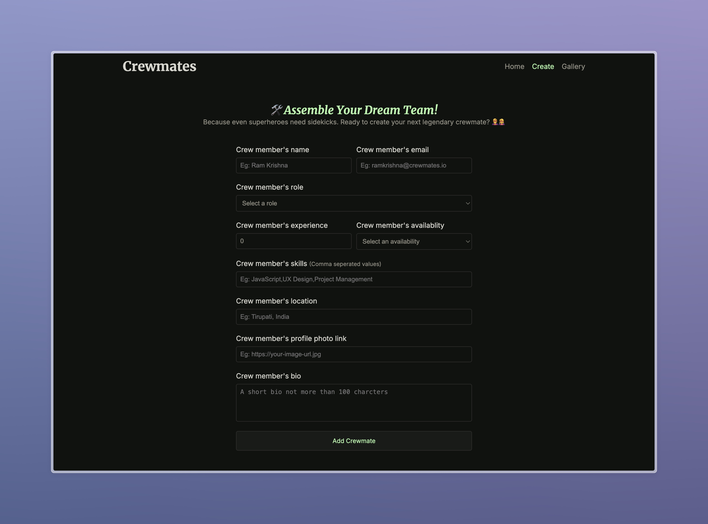
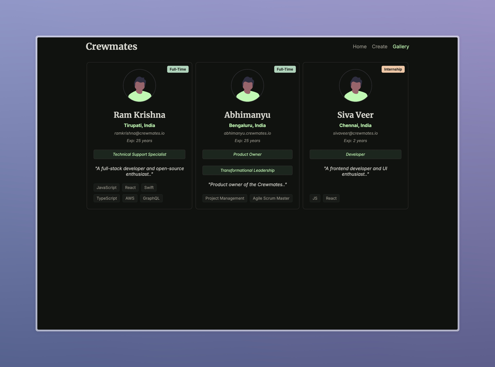

# Codepath Web102 Projects

This repository provides screenshots and live deployment URLs for all projects completed as part of [Codepath](https://www.codepath.org/)'s Intermediate Web Development (WEB102) course.

## Project 1: Community Board - Favorite Developers

- Visit application [here](https://favdev.netlify.app/)

## Project 2: Flashcards - ReactFlash (v1)

- Visit application [here](https://reactflash.netlify.app/)

## Project 3: Flashcards - ReactFlash (v2)

- Visit application [here](https://reactflash.netlify.app/)

## Project 4: Veni-Vici - Trippin' On Cats

- Visit application [here](https://veni-vici.netlify.app/)

## Project 5: Data Dashboard - Marvelous Hub

- Visit application [here](https://marveloushub-v1.netlify.app/)

## Project 6: Data Dashboard - Marvelous Hub (v2)

- Visit application [here](https://marveloushub.netlify.app/)

## Project 7: Crewmates

- Visit application [here](https://crewmates-command-center.netlify.app/)

## Project 8: Chatter Circle

- Visit application [here](https://chattercircle.vercel.app/)

